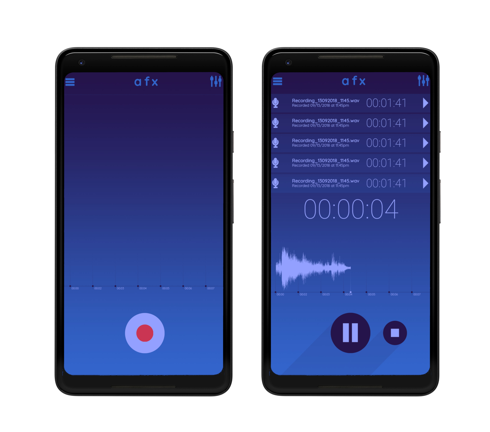
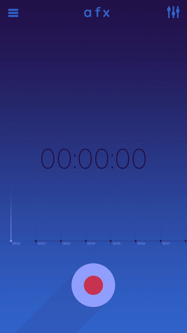

# Audio Recording and Effects Application for Mobile

### Primary Features:

- __RECORD AUDIO__

- __EDIT AUDIO CLIPS__

- __SAVE AND SHARE AUDIO__

### Record Audio:
Using the built in mic on your phone, start recording with the push of a button.
Hitting stop will turn that recording into a playable audio file on your phone. 

### Editing the Audio
Trim, Fade, Cut, Normalize or apply effects to the audio clip that you just recorded.
Effects that could be applied to the audio may include:

- _Delay_
- _Reverb_
- _Distortion_
- _EQ_
- _Cutoff/ Resonance_
- _Bitrate / “crush”_
- _Pitch_

### Save And Share
Save edited files to your phone, __google drive__ or send them via email, messages, whatsapp. 

